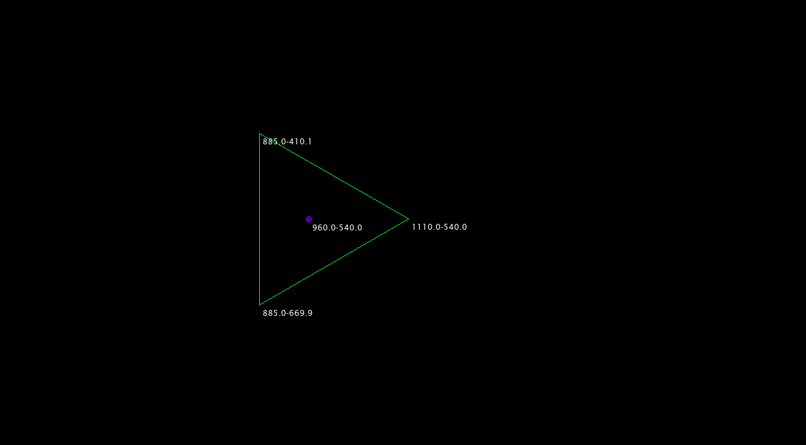
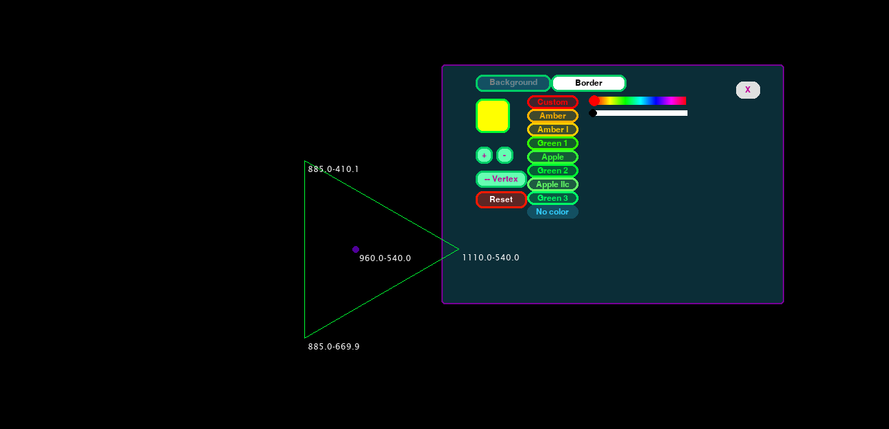
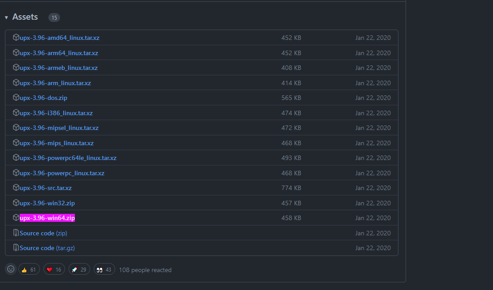

Pygame Polygons
=============

### _Build Pygame Draws - Polygon with user-defined shapes_ 


### Commands


* CTRL Left (HOLD): Polygon settings panel
  * Press and Hold the CTRL left button and hover with the mouse over the polycon center (purple dot). The polygon setting panel will open automatically
* Mouse Wheel: Use the mouse wheel while poiting at the center (purple dot) of a polygon will rotate the polygon from its center
  * UP: turns anti-clockwise
  * Down turns clockwise





### Installation

The installation is done with PyInstaller, in order to use it, follow the instruction in the
[PyInstaller Requirements](https://pyinstaller.org/en/stable/requirements.html)


#### Error UPX is not available

* See on StackOverflow [this](https://stackoverflow.com/questions/70327138/163-info-upx-is-not-available-selenium-pyinstaller-one-file-exe)

1. Chec this documentation [here](https://pyinstaller.org/en/stable/usage.html#using-upx) | https://pyinstaller.org/en/stable/usage.html#using-upx 
2. Go Here -> https://github.com/upx/upx/releases/
3. Download the UPX for your OS, in my case [https://github.com/upx/upx/releases/download/v3.96/upx-3.96-win64.zip](upx-3.96-win64.zip)



4. So in my case I installed in `D:\ups\upx-3.96-win64`
5. Run the installer this way 

```bash 
pyinstaller ./pygame_polygons/name.py -n pygame_polygons -F --key 123456 -w --upx-dir D:\ups\
pyinstaller main.py  -n test -F 
```

