Pygame Polygons
=============

### _Build Pygame Draws - Polygon with user-defined shapes_ 

**Current Version : V 0.0.1 Protoype**

[](https://github.com/Naereen/StrapDown.js/blob/master/LICENSE)
[](https://GitHub.com/Naereen/StrapDown.js/releases/)

[](https://www.python.org/)


### Github / Markdown Budget

**Credit to [Naereen](https://github.com/Naereen/badges)**

Guide
-----

The Apps Allows you do create polygons from 3 to infinite vertices, change their shape, rotate, change the color and more.

### Make a Polygon

As I'm sure you know, a polygon can have from 3 to infinite vertices. So the smallest polygon we can create is a triange
at 3 vertices, and is also the default value. In order to create a polygon, simply press the button **New Shape**

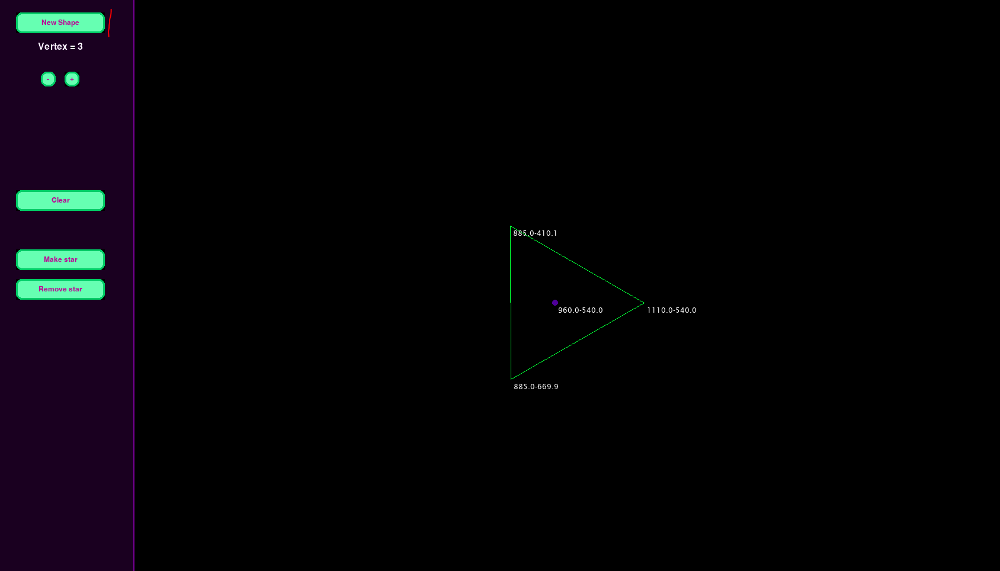

This, will create a new triangle at the center of the screen, at more the less its center.

You can add/remove vertices with the **+**, **-** buttons just below the **New Shape** button.

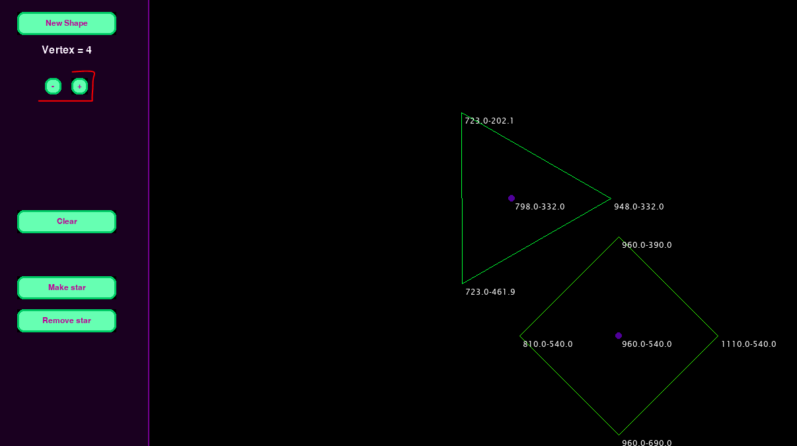

The polygon is composed by the following

* The specified lines (default green)
* Vertex X,Y coordinates 
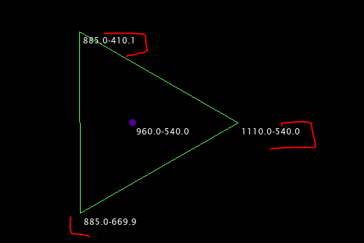
* Vertices Center/Barycenter/Centroid (in purple) and its X,Y coordinates

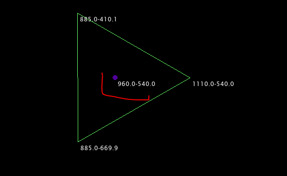


### Rotate a Polygon

You can rotate a polygon both clockwise or anti-clockwise, you can do it so by moving the mouse pointer to a polygon 
barycenter (purple dot) and then use the mouse's scroll. 

* Scroll UP: turns anti-clockwise
* Scroll Down turns clockwise

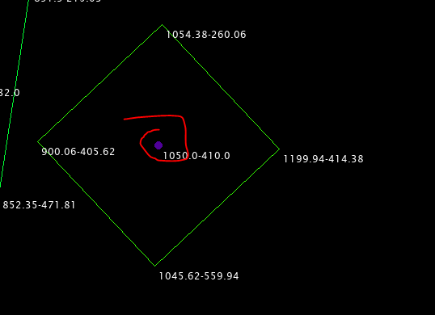

### Change shape of Polygon

You can change the position of any vertex of a polygon, in order to do that, with the mouse pointer hover on top of a vertex
until a red dot appears

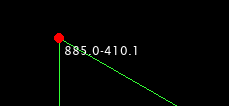
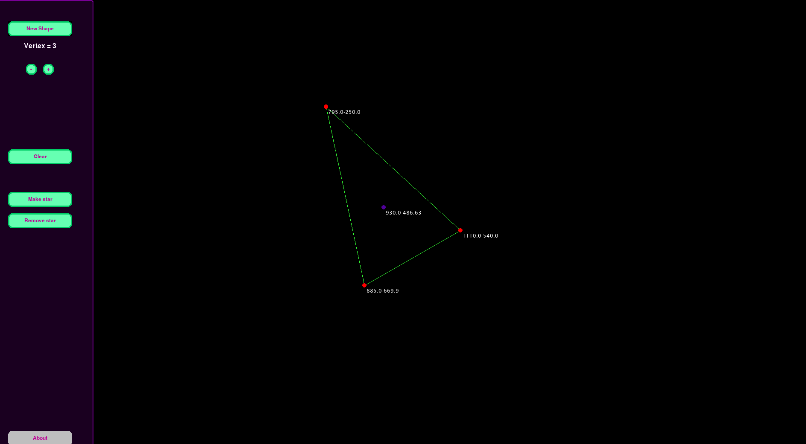

You can see the cursor changes to a 4 arrowed pointer, click the **left mouse** and drag the vertex at any point in the screen.

There is no limit, so you can create any type of irregular shape, after all is like the _matrix_

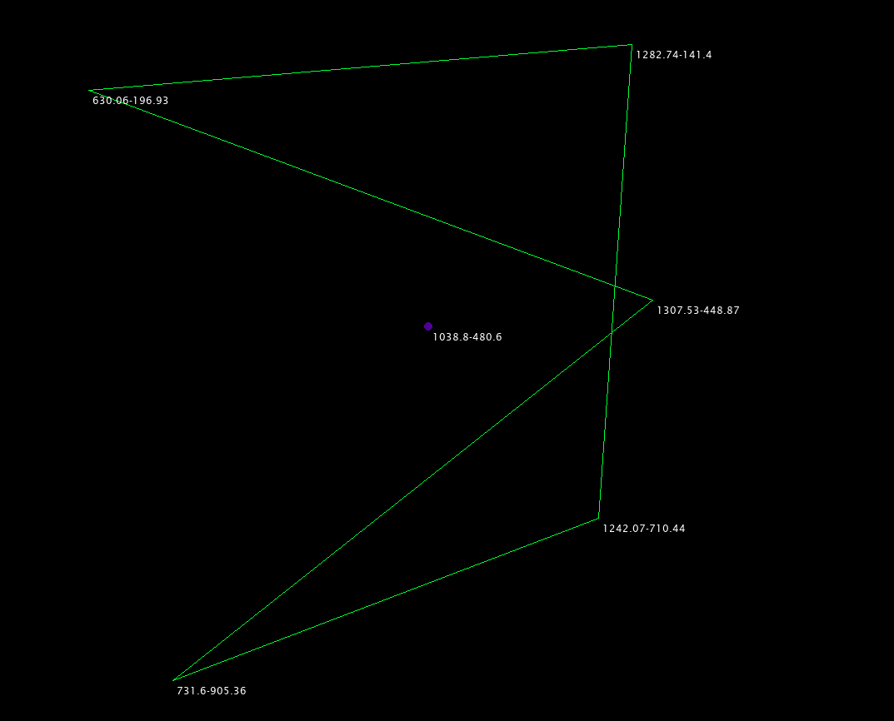

### Polygon settings

_NOTE:_ There is currently many missing features for the settings, right now are only the basic functionalities

Hold **CRLT LEFT** and while holding, hover with the mouose pointer on top of the target polygon, the setting pane menu 
will open automatically

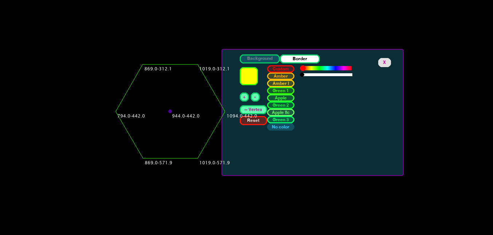

You can change the background color or border color (select what to change by clicking the buttons) , there are some default 
colors (which corresponds to some old terminal color, just for the fun of it, see this StackOverflow response [here](https://superuser.com/questions/361297/what-colour-is-the-dark-green-on-old-fashioned-green-screen-computer-displays))

You can also change width of the border:

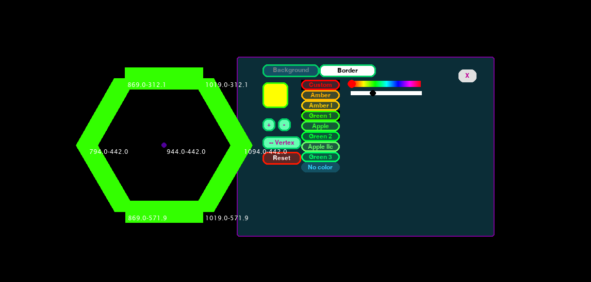

Increase / Remove Vertices (Experimental)

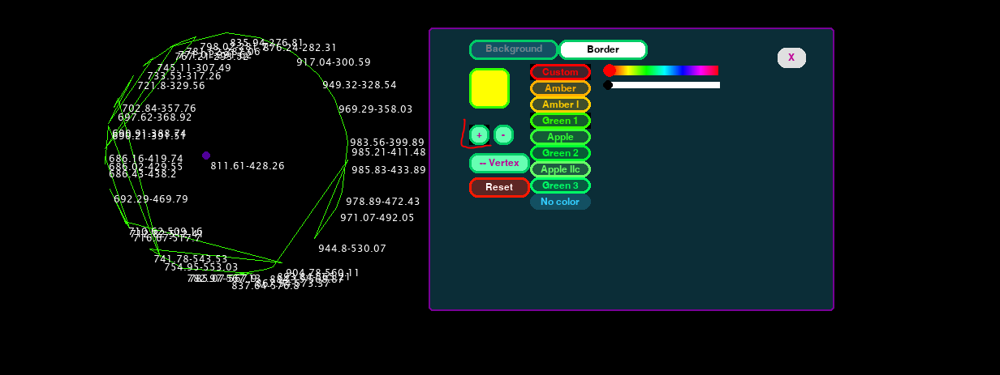

And the reset to initial Values

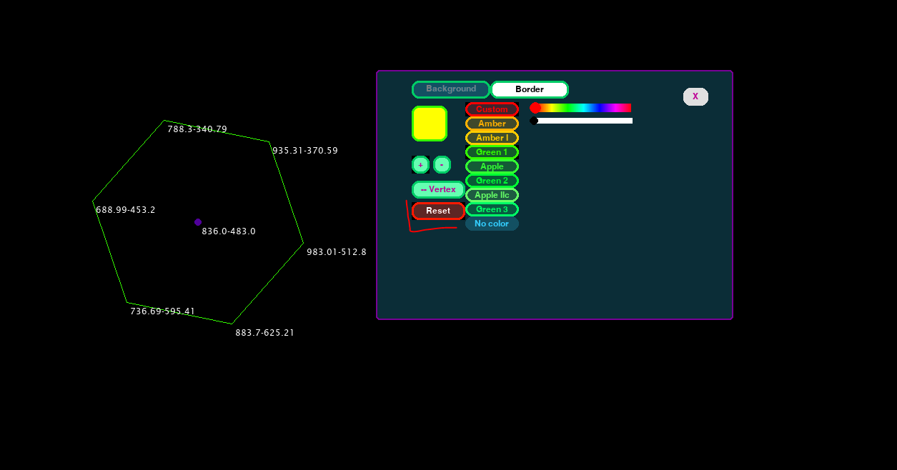

### Clear the screen

You can clear a screen by pressing the button **clear**, which will immediately destroy everything from the canvas.


### Commands


* CTRL Left (HOLD): Polygon settings panel
  * Press and Hold the CTRL left button and hover with the mouse over the polycon center (purple dot). The polygon setting panel will open automatically
* Mouse Wheel: Use the mouse wheel while poiting at the center (purple dot) of a polygon will rotate the polygon from its center
  * UP: turns anti-clockwise
  * Down turns clockwise

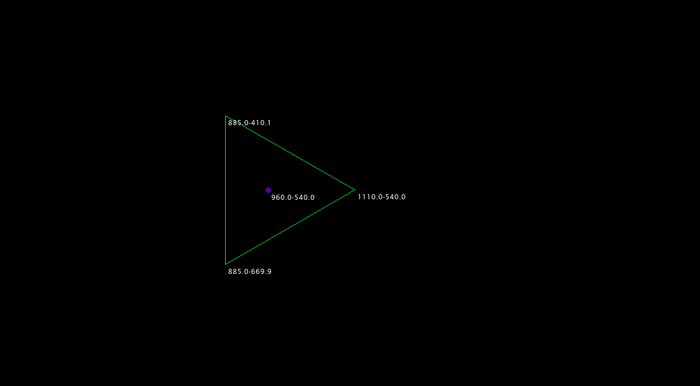
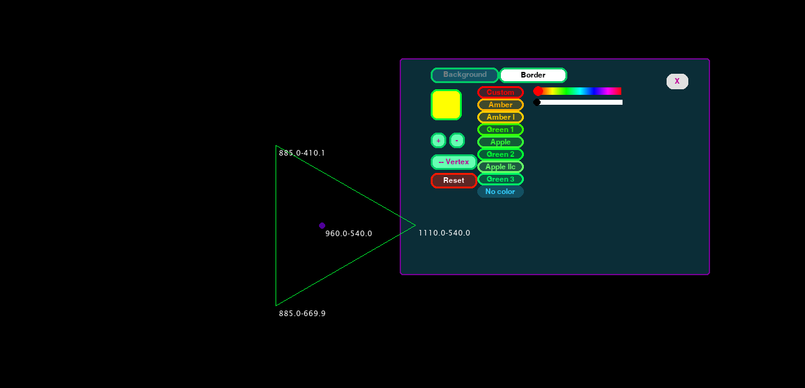


### Make star

This is only a prototype and just to have some fun, however, it is an example of what it could be done, is already a sort
of 'early' / 'rudimental' implementation of **animations**. Basically by pressing the button **Make star**
a 'star' is created and ir rotating at its center

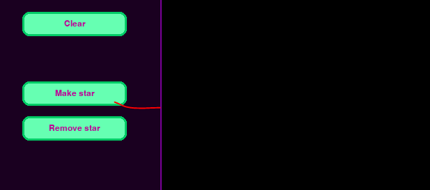

But as you can see from the picture, is really just a 'triangle' that is rotating at 60 frames / second, giving the 
impression to be an actual star

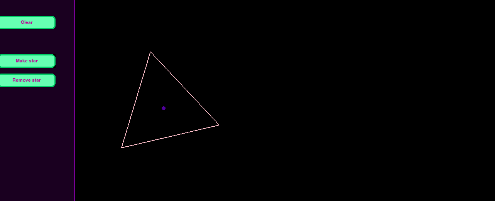

We can add as many start as we want and also remove it

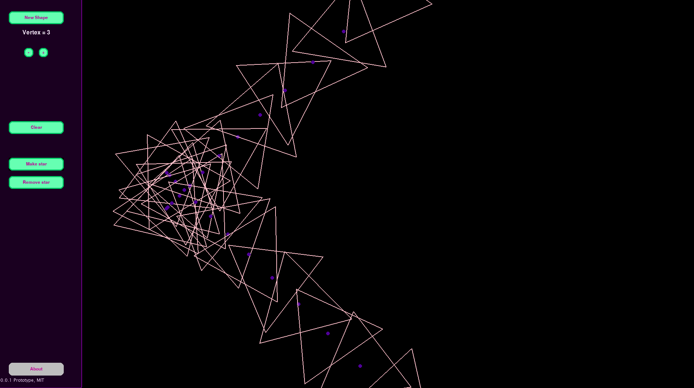


### Installation

The installation is done with PyInstaller, in order to use it, follow the instruction in the
[PyInstaller Requirements](https://pyinstaller.org/en/stable/requirements.html)


#### Error UPX is not available

* See on StackOverflow [this](https://stackoverflow.com/questions/70327138/163-info-upx-is-not-available-selenium-pyinstaller-one-file-exe)

1. Chec this documentation [here](https://pyinstaller.org/en/stable/usage.html#using-upx) | https://pyinstaller.org/en/stable/usage.html#using-upx 
2. Go Here -> https://github.com/upx/upx/releases/
3. Download the UPX for your OS, in my case [https://github.com/upx/upx/releases/download/v3.96/upx-3.96-win64.zip](upx-3.96-win64.zip)

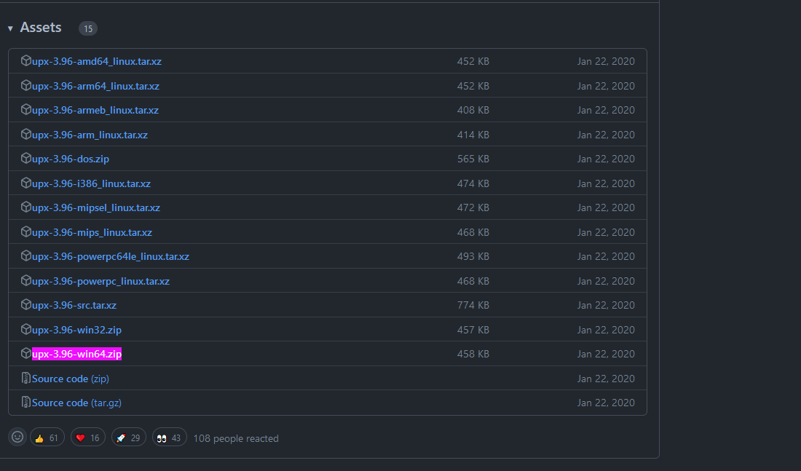

4. So in my case I installed in `D:\ups\upx-3.96-win64`
5. Run the installer this way 

```bash 
pyinstaller ./pygame_polygons/name.py -n pygame_polygons -F --key 123456 -w --upx-dir D:\ups\
pyinstaller main.py  -n test -F 
```


------------------------------------------------------------------------------------------


TODO & Roadmap
--------------

The app is at its first implementation and is only experimental, however a lot of feature can be added 
some of wich is:

### TODO

  * 1) Show press buttons
  * 2) Button Rotate
  * 3) Show button keybords and mouse movements
  * 4) ABle to 'draw' with a canvas (like paint)
  * 5) Make database (SQLite or simple JSON?=
  * 6) Load from database
  * 7) Save from database
  * 8) Make circles and other shapes
  * 9) Add animation system:
      * 1) Create some default animations
      * 2) Add a animation maker?

### FIXME

The application isnt' perfect, and has multiple bugs

1) Add 'vertices' button is broken. see tag 'FIXME_IS_BROKEN'
2) When the polygon has a background color and is moved, the color of the background starts to flicker.
3) Add the logo, currently in `app.py` we can load it but it only works when running the app through python interpreter
not during the installation because it fails, see https://stackoverflow.com/questions/31836104/pyinstaller-and-onefile-how-to-include-an-image-in-the-exe-file
4) The exectutable should not have the other console (windows) however even if has been installed with `--nowindow`
flag, it sill shows